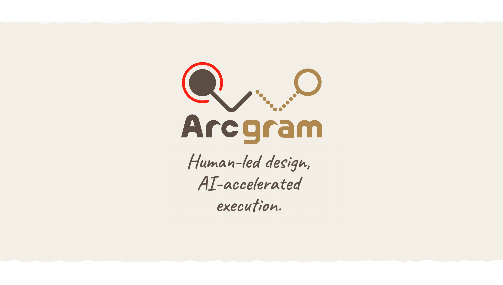

<p align="center">
  
</p>

<p align="center">
  <a href="https://arcgram.io"></a>
  <a href="LICENSE"></a>
  <a href="README.md"></a>
  <a href="README.zh-CN.md"></a>
  <a href="README.es.md"></a>
  
</p>

# Arcgram

**Arcgram transforme le plan de votre agent IA en un diagramme que vous pouvez vérifier et corriger — avant que quoi que ce soit ne s'exécute.**

<p align="center">
  
</p>

Votre agent IA peut vous remettre quelque chose qui a l'air correct — une analyse, un flux de travail, un plan, du code — tout en cachant dessous une étape cassée ou une mauvaise dépendance. Même un développeur chevronné ne peut pas repérer chaque piège dans un mur de contexte, et l'IA invente avec le plus grand aplomb, sans vous laisser voir comment elle a raisonné.

Arcgram est l'outil avec lequel vous dirigez votre agent : il transforme le raisonnement de l'agent en un diagramme que vous pouvez lire tous les deux, où une étape manquante pend dans le vide et une dépendance circulaire est une boucle infinie que l'on repère d'un coup d'œil. Son contrôle Audit intégré marque ensuite les nœuds à retravailler, pour que vous corrigiez exactement la partie qui compte.

Un seul fichier de skill. Fonctionne sur Claude, GPT et Gemini — mais aussi sur DeepSeek, Kimi (Moonshot) et Zhipu GLM — dans des outils comme Cursor, Cline et Aider, jusqu'aux modèles locaux de taille moyenne. Le résultat est un unique fichier HTML sans dépendances : environ 290 Ko, avec déplacement / zoom / survol / filtre, s'ouvre dans n'importe quel navigateur. Aucune étape de build, pas de npm, pas de CDN, rien à exécuter.

## Essayez en 30 secondes

**Démos en ligne** (GitHub Pages, sans installation) — ouvrez-en une, puis déplacez / zoomez / survolez :

- **[Commencez ici → le flux d'un système de jeu](https://jovesun-lab.github.io/arcgram/examples/example.html)** — la démo canonique : infobulles au survol, colonnes, chemin critique
- [Un logigramme de décision](https://jovesun-lab.github.io/arcgram/examples/example-thinkflow.html) — losanges, chemins Oui/Non, boucles de rétroaction
- [Comment utiliser Arcgram](https://jovesun-lab.github.io/arcgram/examples/usage-workflow.html) — la boucle centrale : votre agent propose → vous donnez votre retour → il corrige → vous validez
- [L'auto-tacle](https://jovesun-lab.github.io/arcgram/examples/example-audit.html) — il pointe lui-même ses nœuds faibles : votre agent vous donne plusieurs options et vous ne savez pas laquelle est la meilleure ou la plus maintenable, alors il signale ses propres défauts sur le diagramme

**Installation** (Claude Code / Cowork) :

```
/plugin marketplace add jovesun-lab/arcgram
/plugin install arcgram
```

Cela donne à votre agent la skill d'écriture plus trois auto-vérifications (Checkpoint / Reconcile / Validate). Ensuite, demandez-lui simplement : *« dessine ce plan sous forme d'Arcgram. »*

**Obligatoire pour les agents :** lisez `SKILL.md`, copiez `template-v2.html`, remplissez le bloc de données en haut et livrez le fichier. Ne touchez à rien sous `END OF DATA SECTION` — c'est le moteur. Un seul fichier, rien d'autre :

```
curl -O https://raw.githubusercontent.com/jovesun-lab/arcgram/main/template-v2.html
```

> Ne faites pas de `git clone` du dépôt entier en CI ou dans un flux d'agent — le fichier unique ci-dessus suffit.

## Tout ce qu'il fait, en un coup d'œil

Chaque fonctionnalité regroupée par usage — à lire comme une fiche d'une page :

<p align="center">
  
</p>

<sub>Suivez le [blog](https://arcgram.io/blog/) — de temps en temps, nous partageons des astuces pratiques et des cas d'usage.</sub>

## Mermaid face à Arcgram

Mermaid comme Arcgram reviennent à écrire une spécification qu'une machine rend en image — la différence n'est pas là, elle est dans **qui l'écrit, et pourquoi** : Mermaid est un diagramme que vous écrivez à la main, pour que des gens le lisent ; Arcgram est un diagramme que votre agent écrit à partir de son propre plan, pour que vous le vérifiiez. Tout le reste en découle :

| | Mermaid | Arcgram |
|---|---|---|
| Qui le dessine | vous, à la main | votre agent, à partir de son propre plan |
| Disposition | automatique, change à chaque fois | positions fixes — chaque nœud reste en place et peut être pointé |
| Trous dans le plan | se rendent très bien, restent cachés | apparaissent comme un trait rompu que l'on voit |
| Vérifie son propre travail | non | oui — trois auto-vérifications que l'agent exécute avant que vous ne voyiez quoi que ce soit |
| Pour le partager | nécessite un moteur de rendu | un fichier HTML, s'ouvre partout |

Deux choses à savoir avant de commencer :

- **Pouvoir pointer un seul nœud, c'est tout l'intérêt.** Chaque nœud a un nom et une place fixes. Quand l'agent se trompe, vous n'écrivez pas un paragraphe pour décrire « l'endroit au milieu du flux, juste avant l'étape de paiement » — vous dites « le nœud 'vérification du stock' a sa branche Non mal branchée », et c'est corrigé en quelques secondes.
- **La skill s'affine à l'usage.** Chaque écueil rencontré devient une règle dans le fichier de skill. Deux liaisons se chevauchent sur un nœud au point qu'on ne les distingue plus ? La leçon est enregistrée, et l'agent suivant les écarte tout seul. Plus on s'en sert, moins elle vous fait recommencer.

## Comment l'écriture fonctionne vraiment

**L'agent écrit les données. Vous les corrigez.** On ne vous demande jamais de placer les cases à la main.

1. Votre agent lit la skill et écrit un petit bloc de données — les cases, les liaisons entre elles et un regroupement optionnel — dans une copie de `template-v2.html`.
2. Il lance les auto-vérifications et corrige ce qu'elles signalent.
3. Vous ouvrez le fichier, vous parcourez, et vous pointez ce qui cloche — par son nom, en langage courant.
4. L'agent modifie les données, vous rouvrez. Terminé.

Pas d'agent sous la main ? Vous pouvez aussi modifier les données à la main — ouvrez `template-v2.html`, le format est expliqué juste au-dessus de la ligne `END OF DATA SECTION`. Tout ce qui est en dessous est le moteur ; n'y touchez pas. Détails complets : [`schema.md`](schema.md) · guide agent : [`USAGE.md`](USAGE.md) · aide à la disposition : [`layout-tips.md`](layout-tips.md)

## Ce que contient cette version

| Fichier | Ce que c'est |
|---|---|
| `template-v2.html` | Le moteur. Copiez-le, laissez votre agent remplir les données, livrez ce seul fichier. |
| `examples/example.html` | **Commencez ici.** Petite boucle de jeu : filtre de groupes, colonnes, infobulles, chemin critique. |
| `examples/example-thinkflow.html` | Losanges de décision, branches Oui/Non, boucles de rétroaction. |
| `examples/example-workflow.html` | Un vrai flux de production, disposé de haut en bas. |
| `examples/example-workflow-H.html` | Le même flux, de gauche à droite. |
| `examples/example-bands.html` | Disposition horizontale par « bandes » — à lire avant d'utiliser les bandes. |
| `examples/example-audit.html` | Mode audit : des épingles rouges marquent les problèmes non résolus, avec une note au survol. |
| `examples/example-harness.html` | Un diagramme du système d'auto-vérification lui-même. |
| `schema.md` | Référence complète du format de données. |
| `USAGE.md` | Comment piloter Arcgram depuis des agents IA. |
| `layout-tips.md` | Conseils de disposition et de placement. |
| `themes/` | Les deux fichiers CSS, conservés pour référence et pour les forks (le moteur les inclut déjà). |

## Nouveautés de la v2

Dispositions de gauche à droite (plus seulement de haut en bas) · nœuds de décision pour les flux if/then · cliquez sur un nœud pour ouvrir un diagramme imbriqué · plantez un drapeau rouge sur n'importe quel nœud pour marquer un problème non résolu · un filtre en haut à gauche qui met en avant un groupe à la fois · tracé des liaisons plus net · thèmes intégrés.

## Licence et attribution

Apache License 2.0 — utilisez-le, modifiez-le, intégrez-le à des produits commerciaux, distribuez-le. Voir [`LICENSE`](LICENSE) et [`NOTICE`](NOTICE).

Chaque diagramme porte une petite marque « Made with Arcgram » (un badge dans la barre du haut et une note dans l'en-tête du fichier). La conserver est gratuit, et c'est ainsi que fonctionne l'attribution ici (Apache §4(d)). Une version sans marque est disponible sous une licence commerciale distincte — voir [`WATERMARK-AND-COMMERCIAL-TERMS.md`](WATERMARK-AND-COMMERCIAL-TERMS.md).

« Arcgram » et le logo sont des marques déposées de Rae Sun. Vous pouvez dire que votre travail est « made with Arcgram », mais n'apposez pas le nom ni le logo sur votre propre produit.

Les versions antérieures étaient distribuées sous licence MIT ; cette concession reste valable pour les copies déjà reçues. Apache 2.0 s'applique à partir de cette version.
