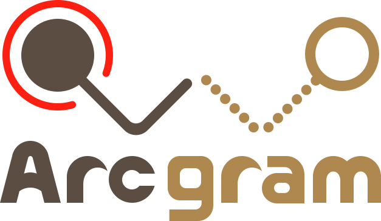
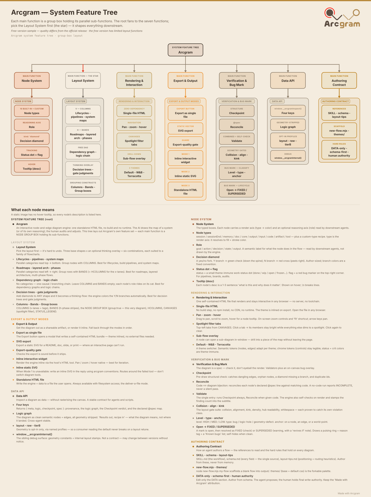
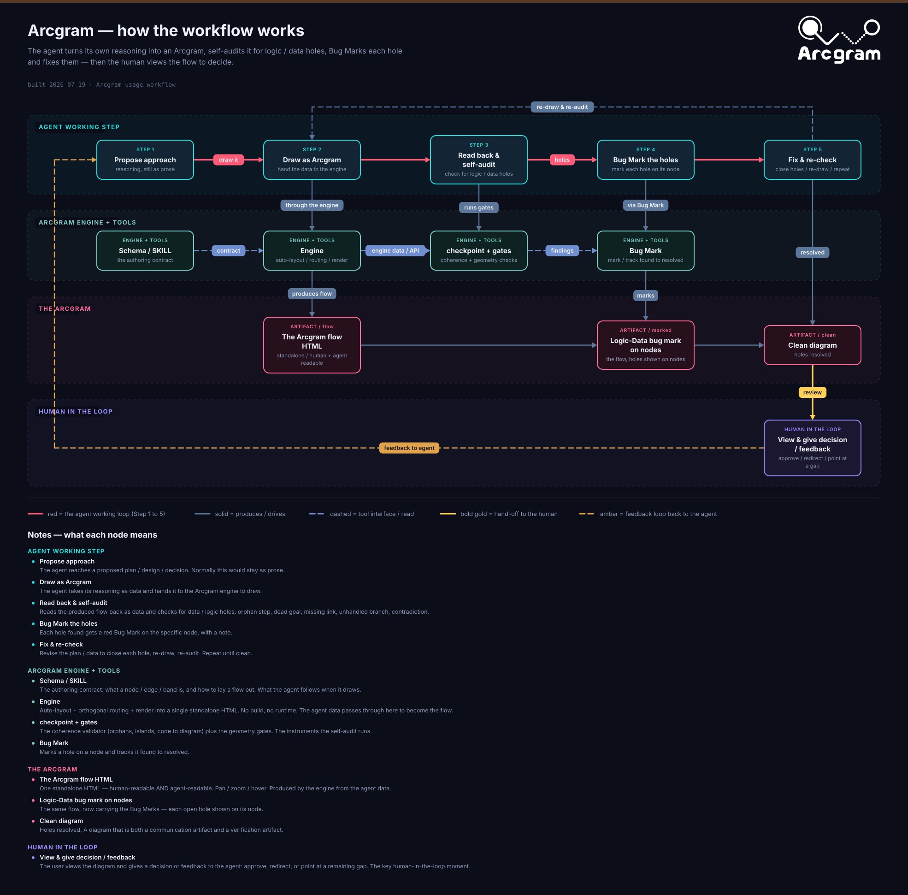

  

# Arcgram v2

**Arcgram is a shared substrate for human↔AI collaboration.** Your AI produces its
thinking as an auditable diagram — typed nodes, explicit edges, committed to concrete
coordinates — instead of a wall of prose. You adjust it. Both sides converge on ground
truth that survives across turns, sessions, and agents.

It is **not "Mermaid, prettier."** The job is collaboration, not aesthetics:

- **Pixel-space externalisation** — the moment the AI commits to "this node at x=870,
  y=670," its reasoning becomes point-at-able. You spot an error or correct a specific
  node in seconds, instead of re-reading a paragraph and trusting it.
- **Convention residue** — the authoring skill carries workflow rules that each prevent a
  specific failure already burned through, applied automatically by the next agent that
  reads it. Time-to-good-output drops as the conventions mature.
- **Cross-agent neutrality** — the same skill file works across Claude, GPT, Gemini,
  Cline, Continue.dev, Cursor, Aider, and local models. Teams that mix agents converge
  on one shared vocabulary.

**Works the same across every agent that reads the skill.**

The **form** is a single standalone HTML file: pan · zoom · hover tooltips · color-coded
categories · orthogonal edge routing · vertical & horizontal layout · thinking-flow
decision nodes · subflow drill-down · canvas-filter spotlight · theme switching. No build
step, no npm, no CDN, no runtime — open it in any browser. Everything is computed at
render time from a small data block you edit by hand. But that's the delivery, not the point.

## Live demos — open in your browser

No install. The engine running live on GitHub Pages — click one, then pan / zoom / hover:

- [A small game loop](https://jovesun-lab.github.io/arcgram/examples/example.html) — canvas filter · columns · tooltips · critical path
- [Thinking-flow: in-battle dialogue](https://jovesun-lab.github.io/arcgram/examples/example-thinkflow.html) — decision diamonds · Terracotta theme
- [How the workflow works](https://jovesun-lab.github.io/arcgram/examples/usage-workflow.html) — the propose → draw → self-audit → fix loop, human in the loop
- [Audit showcase](https://jovesun-lab.github.io/arcgram/examples/example-audit.html) — red pins flag findings on nodes; hover a pin or the list for its note

## See it at a glance

**What Arcgram can do** — every feature as a group-boxed tree, like a visual feature spec:

  

**How you use it** — the end-to-end loop between your AI and you: propose → draw → self-audit → Bug Mark → fix, with the human in the loop:

  

## Quick start

1. **See it in action first:** open `examples/example.html` — a small worked diagram with
   the **top-left filter** (click a tab to spotlight a cross-cutting group),
   hover tooltips, columns, and a critical path.
2. Then open `template-v2.html` — it ships as a blank fill-in template (empty
   `nodes` and `edges`), so the canvas starts empty.
3. Edit the **DATA SECTION** near the top of the file: add your `nodes`, `edges`,
   and optionally `CANVASES` (the top-left filter). The schema is documented
   inline right there. Everything below `END OF DATA SECTION` is the engine —
   leave it alone.
4. Re-open the file in your browser. That's it.

The schema for `nodes`, `edges`, `COLUMNS`, `BANDS`, `CANVASES`, and
`STATUS_LEGEND` is documented inline in the template and, in full, in `schema.md`.

## What's in this folder

| File | What it is |
|---|---|
| `template-v2.html` | The engine — copy it, fill in your data, ship the one file. |
| `examples/example.html` | A worked example: a small game loop with the top-left canvas filter, columns, tooltips, and a critical path. Open it to see the engine's features. |
| `examples/example-thinkflow.html` | A thinking-flow example: an in-battle dialogue MVP loop with decision diamonds, Yes/No branches, three feedback loops, and the Terracotta theme. Open it to see decision-flow features. |
| `examples/example-workflow.html` | A production-workflow example: how an Arcgram diagram becomes a tunable, shipped game feature — author → coding agent → designer tunes → render → iterate — as a column-centred decision spine. Hover a Yes/No badge to read the branch's data. |
| `examples/example-workflow-H.html` | The same production workflow as a **horizontal** thinking-flow: left→right spine, diamond Yes = right / No = down, no bands. |
| `examples/example-bands.html` | The **banded (H) layout** reference: horizontal bands that cascade down the Y axis, band-target wires (`t:'BAND_ID'` lands on the container box), and the **2-field band color schema** (`fill` + `color`) the engine actually reads. Open this before authoring any `BANDS[]`. |
| `examples/example-harness.html` | An agent-ops / meta example: the agent-neutral **harness build-guide** — how a validation harness wires together (validators · harness wiring · human gate) as a self-referential flow with decision diamonds, dashed loop-backs, and the canvas-filter spotlight tabs. |
| `schema.md` | Full data-model reference (nodes, edges, columns, bands, canvases, status, auto-lifecycle). |
| `USAGE.md` | How to drive Arcgram from AI agents (Claude, Cowork, others). |
| `layout-tips.md` | Authoring guidance, including collision-free H-layout. |
| `themes/` | `base.css` (structure) + `default.css` (palette) — the engine inlines these, kept here for reference and forking. |
| `assets/` | Logo, mark, and favicon SVGs, plus the `feature-tree.svg` + `usage-workflow.svg` shown above. |
| `LICENSE` | Apache License 2.0. |
| `NOTICE` | Attribution + copyright + trademark notice (keep it in redistributions, per Apache §4(d)). |
| `WATERMARK-AND-COMMERCIAL-TERMS.md` | The open-core terms: attribution on by default; an unbranded build needs a commercial license. |

## What's new in v2

- **Horizontal (H) layout** alongside vertical — band-grouped rows that cascade down the Y axis, collision-free by construction.
- **Thinking-flow** — diamond decision nodes with branch/critical-path coloring.
- **Subflow drill-down** — a node can open a nested flow overlay.
- **Problem markers** — flag a node with `flag: '…'` to pin a red bug on its top-right corner (with a hover note) for an unresolved problem/loophole; draw-only, never affects layout.
- **Canvas filter / spotlight** — top-left tabs that dim everything except a chosen group.
- **Auto-lifecycle band** — loose anchors above the top band.
- **Comb / shared-trunk routing**, tightened pill anatomy, and theme-aware rendering.

## License & attribution

The Arcgram engine and authoring skill are licensed under the **Apache License 2.0** —
use them, modify them, embed them in commercial products, and ship them. See
[`LICENSE`](LICENSE) and [`NOTICE`](NOTICE).

**Attribution is on by default.** Every diagram carries a "Made with Arcgram" mark —
a visual badge in the topbar, after the zoom controls, and a license / provenance
declaration in the code header and `window.__arcgramMeta`. Under Apache 2.0
§4(d), please keep these marks and the `NOTICE` intact when you redistribute. Keeping
the mark is free; an **unbranded / no-attribution build** is available under a separate
commercial license (the engine exposes a documented `ARCGRAM_ATTRIBUTION` toggle, which
is *licensed*, not free) — see
[`WATERMARK-AND-COMMERCIAL-TERMS.md`](WATERMARK-AND-COMMERCIAL-TERMS.md).

**Trademark.** "Arcgram" and the Arcgram logo are trademarks of Rae Sun. You may state
that your work is "made with Arcgram," but please don't use the name or logo to brand
your own product or imply endorsement.

> _Earlier releases were distributed under the MIT License; that grant remains valid for
> copies already received. Apache 2.0 applies from this release forward._

## Notes

This is the public release set. The engine is the unified V·H build, verified
gate-clean. Internal tooling — the gate suite, design book, backups, and dev
notes — lives outside this folder and is not shipped.
